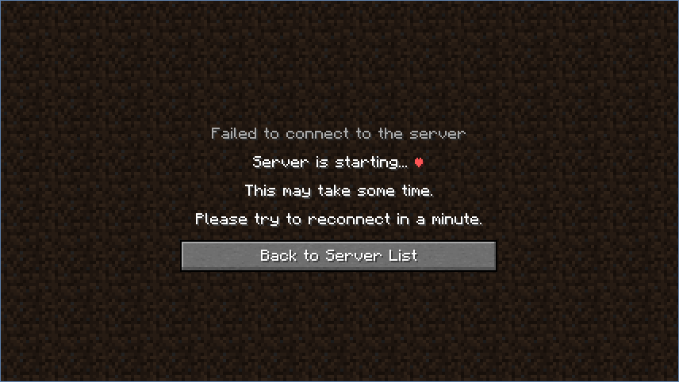

# lazymc

`lazymc` puts your Minecraft server to rest when idle, and wakes it up when
players connect.

Some Minecraft servers (especially modded) use an insane amount of resources
when nobody is playing. lazymc helps by by stopping your server when idle,
until a player connects again.

lazymc functions as proxy between clients and the server. It handles all
incoming status connections until the server is started and then transparently
proxies the rest.

_Note: this is a prototype and may be incomplete._

https://user-images.githubusercontent.com/856222/140804726-ba1a8e59-85d9-413b-8229-03be84b55d51.mp4

<details><summary>Click to see screenshots</summary>
<p>





</p>
</details>

## Requirements

- Linux, macOS, Windows
- Minecraft Java Edition 1.6 or above
- On Windows: RCON (automatically managed by default)

Using a modded Minecraft server and client (such as Forge) should work fine.

## Usage

Make sure you meet all [requirements](#requirements).

_Note: Installation options are limited at this moment. Read-to-go binaries will
be published later. For now we compile and install from source._

To compile and install you need Rust, install it through `rustup`: https://rustup.rs/

When Rust is installed, compile and install `lazymc` from this git repository:

```bash
# Compile and install lazymc from source
cargo install -f --git https://github.com/timvisee/lazymc

# Ensure lazymc works
lazymc --help
```

When `lazymc` is available, change into your server directory. Then set up the
[configuration](./res/lazymc.toml) and start it up:

```bash
# Change into your server directory
cd server

# Generate lazymc configuration
lazymc config generate

# Edit configuration
# Set the correct server address, directory and start command
nano lazymc.toml

# Start lazymc
lazymc start
```

Everything should now be running. Connect with your Minecraft client to wake
your server up!

## License

This project is released under the GNU GPL-3.0 license.
Check out the [LICENSE](LICENSE) file for more information.
